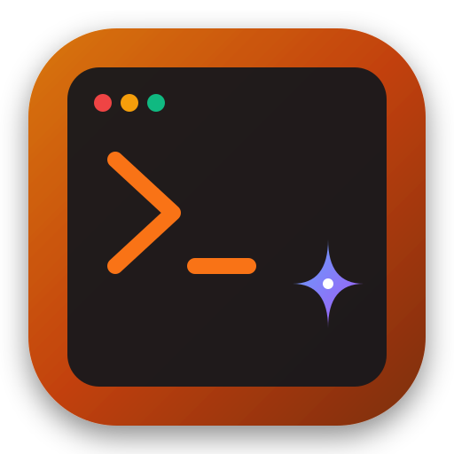

# 🌟 FreeClaude — Claude Code to Google Gemini Proxy

<p align="center">
  
</p>

<p align="center">
  <b>Бесплатный, быстрый и отказоустойчивый локальный прокси-сервер для утилиты Claude Code CLI (<code>claude</code>), маршрутизирующий вызовы в Google Gemini API.</b>
</p>

<p align="center">
  
  
  
  
  
  
</p>

---

## ⚡ Что это такое и зачем нужно?

Официальный CLI-инструмент **Claude Code** (`claude`) от Anthropic требует платной подписки и доступа к Anthropic API.

**FreeClaude** — это локальный легковесный шлюз-эмулятор Anthropic Messages API (`POST /v1/messages`), который:
1. Принимает запросы от консольного клиента `claude` (включая стриминг SSE, вызовы системных команд и инструментов `Bash`).
2. Преобразует сообщения в формат Google Gemini API.
3. Прозрачно ротирует ваши бесплатные API-ключи Gemini при исчерпании лимитов (HTTP 429).
4. Каскадно переключает модели при перегрузке (HTTP 503).
5. **Сохраняет и восстанавливает криптографические подписи `thoughtSignature`** в Gemini Thinking моделях (Gemini 3.x), благодаря чему многошаговые вызовы инструментов (tool calling) работают непрерывно и без ошибок 400.

---

## 🔥 Ключевые возможности

- 🤖 **100% совместимость с Claude Code CLI**:
  - Полная эмуляция `/v1/messages`, `GET/HEAD /api/hello`, подсчета токенов `/v1/messages/count_tokens`.
  - Потоковая передача данных (SSE Streaming `text/event-stream`).
  - Поддержка выполнения Bash-команд, чтения, поиска и редактирования файлов.
- 🧠 **Автоматический обход ограничений Thinking-моделей (`thoughtSignature`)**:
  - В Gemini 3.x при вызовах инструментов генерируется служебный криптографический токен `thoughtSignature`.
  - FreeClaude кэширует его и автоматически подставляет в историю диалога на следующем шаге, устраняя ошибку `Function call is missing a thought_signature`.
- 🔄 **Умная ротация пула API-ключей**:
  - Поддержка нескольких бесплатных ключей Google Gemini (`GEMINI_API_KEYS=key1,key2,key3...`).
  - Round-robin балансировка.
  - При получении **HTTP 429 (Resource Exhausted)** ключ уходит на 60-секундный кулдаун, а запрос мгновенно отправляется со следующего доступного ключа.
- 🛡️ **Каскадный Fallback моделей**:
  При перегрузке модели (HTTP 503) сервер ставит модель на кулдаун 30 секунд и автоматически переключается:
  1. `gemini-3.8-flash` (5 RPM / 20 RPD) — новейшая быстрая модель
  2. `gemini-3.7-flash` (5 RPM / 20 RPD) — флагманский резерв
  3. `gemini-3.6-flash` (5 RPM / 20 RPD) — стабильный резерв
  4. `gemini-3.5-flash-lite` (15 RPM / **500 RPD**) — гигантский суточный лимит (500 запросов на ключ!)
  5. `gemini-3.1-flash-lite` (15 RPM / **500 RPD**) — дополнительный объемный резерв
- 🚀 **Режим Antigravity Agent для сборки проектов**:
  При командах вида *"собери проект"*, *"build project"* автоматически активируется движок Antigravity с отдельной квотой агентов (60 RPM / 100 RPD).
- 🐧 **Linux / Arch Linux Integration**:
  - Автозапуск как фоновый `systemd --user` сервис (`freeclaude.service`).
  - Скрипт-обертка запуска [scripts/launch_claude.sh](scripts/launch_claude.sh).
  - Готовый ярлык рабочего стола `.desktop` для терминала `konsole`.

---

## 🔒 БЕЗОПАСНОСТЬ: ВАШИ API-КЛЮЧИ

> [!WARNING]
> **НИ В КОЕМ СЛУЧАЕ НЕ ПУШИТЕ ВАШ ФАЙЛ `.env` В GIT!**
> 
> - Файл `.env` содержит ваши личные секретные ключи Google Gemini.
> - Файл `.env` **уже добавлен в `.gitignore`** и защищен от коммитов.
> - Для публикации и развертывания используйте шаблон `.env.example`.
> - Всегда проверяйте `git status` перед коммитами, чтобы убедиться, что `.env` не отслеживается.

---

## 📦 Быстрая установка и настройка

### 1. Требования
- **Linux** (Arch Linux, Ubuntu, Fedora и др.)
- **Python 3.10+**
- **Node.js 18+** и установленный Claude Code CLI:
  ```bash
  npm install -g @anthropic-ai/claude-code
  ```
  *(или через AUR на Arch: `yay -S claude-code-bin`)*

### 2. Клонирование репозитория
```bash
git clone https://github.com/XesteRR76/FreeClaude.git
cd FreeClaude
```

### 3. Настройка виртуального окружения Python
```bash
python3 -m venv venv
source venv/bin/activate
pip install -r requirements.txt
```

### 4. Настройка API-ключей Gemini
Получите бесплатные ключи в [Google AI Studio](https://aistudio.google.com/):
```bash
cp .env.example .env
nano .env  # или любой удобный редактор
```

Впишите один или несколько ключей через запятую:
```ini
GEMINI_API_KEYS=AIzaSyD...,AIzaSyB...
GEMINI_API_KEY=AIzaSyD...
```

---

## 🚀 Запуск сервера

### Способ 1. Автозапуск через systemd (Рекомендуется для Linux)

Создайте пользовательский systemd-сервис:
```bash
mkdir -p ~/.config/systemd/user

cat <<EOF > ~/.config/systemd/user/freeclaude.service
[Unit]
Description=FreeClaude - Claude Code to Google Gemini Emulation Proxy
After=network.target

[Service]
Type=simple
WorkingDirectory=$(pwd)
EnvironmentFile=$(pwd)/.env
ExecStart=$(pwd)/venv/bin/uvicorn app.main:app --host 127.0.0.1 --port 8080 --log-level info
Restart=always
RestartSec=3

[Install]
WantedBy=default.target
EOF

systemctl --user daemon-reload
systemctl --user enable --now freeclaude.service
```

Проверка статуса сервиса:
```bash
systemctl --user status freeclaude.service
```

Просмотр логов в реальном времени:
```bash
journalctl --user -u freeclaude -f
```

---

### Способ 2. Запуск через скрипт в фоне

```bash
# Фоновый запуск
./scripts/start_proxy.sh --daemon

# Проверка статуса
./scripts/start_proxy.sh --status

# Остановка
./scripts/start_proxy.sh --stop
```

---

## 💻 Подключение Claude Code

Добавьте переменные в конфигурацию вашей оболочки. 

Для **Zsh** (Arch Linux по умолчанию):
```bash
cat <<'EOF' >> ~/.zshenv
# FreeClaude Proxy
export ANTHROPIC_BASE_URL="http://127.0.0.1:8080"
export ANTHROPIC_API_KEY="freeclaude"
EOF
```

Для **Bash**:
```bash
cat <<'EOF' >> ~/.bashrc
# FreeClaude Proxy
export ANTHROPIC_BASE_URL="http://127.0.0.1:8080"
export ANTHROPIC_API_KEY="freeclaude"
EOF
```

Примените изменения:
```bash
source ~/.zshenv 2>/dev/null || source ~/.bashrc
```

---

## 🔑 Автономная работа и Sudo (Опционально)

### Запуск без постоянных подтверждений
Чтобы Claude Code выполнял операции (чтение файлов, вызовы команд) автономно:
```bash
claude --dangerously-skip-permissions
```
*(Скрипт `scripts/launch_claude.sh` уже настроен с этим флагом).*

### Настройка `sudo` без ввода пароля
Если вы хотите, чтобы Claude Code мог выполнять команды администратора (`pacman`, `systemctl`) без зависания в терминале:
```bash
echo "$USER ALL=(ALL:ALL) NOPASSWD: ALL" | sudo tee /etc/sudoers.d/claude-nopasswd
sudo chmod 0440 /etc/sudoers.d/claude-nopasswd
```

---

## 🖥️ Ярлык на рабочем столе (Arch / KDE / GNOME)

Создайте ярлык приложения для быстрого запуска:
```bash
./scripts/create_desktop_shortcut.sh
```
Ярлык появится на рабочем столе (`~/Desktop/Claude-Code.desktop`) и в системном меню приложений.

---

## 🧪 Запуск тестов

Проект полностью покрыт модульными и E2E тестами:
```bash
./venv/bin/pytest -v
```

Все **18 тестов** проверяют:
- Валидацию и очистку схем параметров инструментов.
- Прямую и обратную трансляцию Anthropic ⇄ Gemini.
- Кэширование и восстановление подписей `thoughtSignature`.
- Round-robin ротацию ключей и кулдауны 429.
- Каскадный failover моделей при 503.
- Детектор сборки проектов Antigravity.

---

## 📁 Структура проекта

```
FreeClaude/
├── app/
│   ├── main.py              # FastAPI сервер, эндпоинты /v1/messages, /health, /api/hello
│   ├── config.py            # Настройки и чтение .env
│   ├── key_manager.py       # Ротация ключей и 60s cooldown при 429
│   ├── model_fallback.py    # Координатор каскадного фолбэка моделей при 503
│   ├── thought_signatures.py# Кэш и инъектор криптографических подписей thoughtSignature
│   ├── antigravity_engine.py# Детектор сборки проекта и движок Antigravity Agent
│   ├── translator.py        # Двусторонняя трансляция протоколов и санитизация схем
│   └── gemini_client.py     # HTTP-клиент к Google Gemini API (SSE & JSON)
├── assets/
│   └── claude-icon.svg      # Векторная иконка приложения
├── scripts/
│   ├── start_proxy.sh       # Управление сервером (start, --daemon, --stop, --status)
│   ├── launch_claude.sh     # Обертка запуска Claude Code CLI
│   └── create_desktop_shortcut.sh # Генератор .desktop ярлыка для Arch Linux
├── tests/
│   ├── test_antigravity_build.py # Тесты сборщика проектов
│   ├── test_translator.py   # Тесты транслятора протоколов, подписей и SSE
│   ├── test_key_rotation.py # Тесты ротации и кулдауна ключей
│   └── test_e2e.py          # E2E тесты эндпоинтов и каскадного переключения
├── .env.example             # Пример конфигурации БЕЗ секретов
├── .gitignore               # Исключение .env, логов и кэша
├── requirements.txt         # Зависимости Python
├── pytest.ini               # Конфигурация тестового фреймворка
└── README.md                # Документация проекта
```

---

## 📄 Лицензия

Распространяется под лицензией [MIT](LICENSE). Разработано для сообщества открытого ПО.
